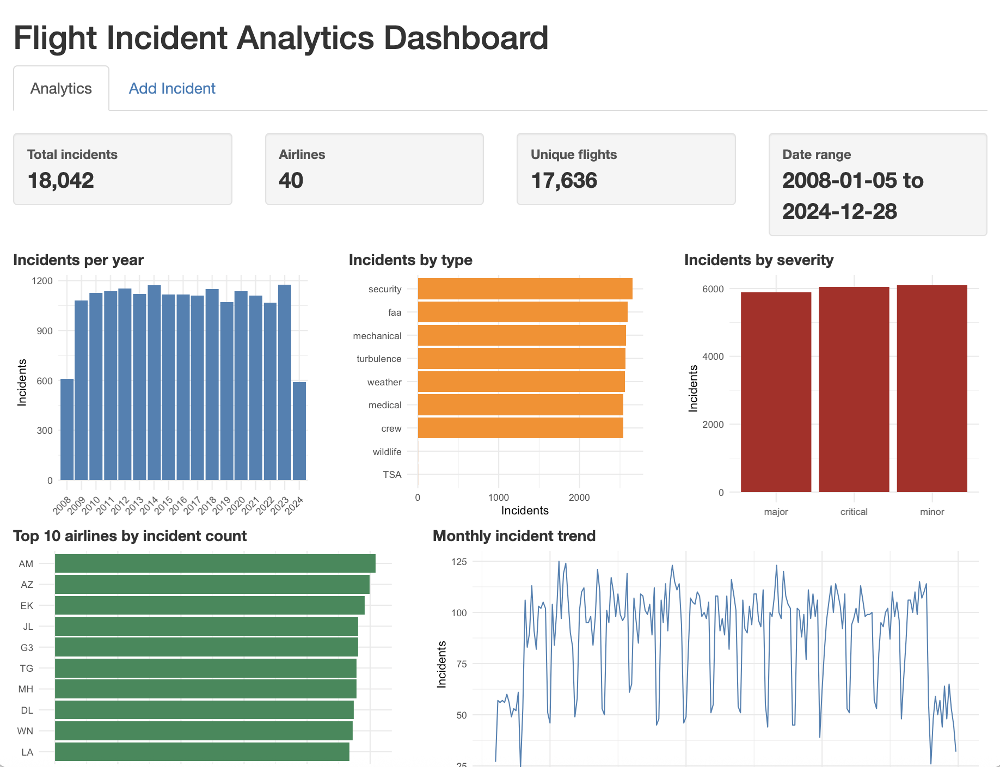
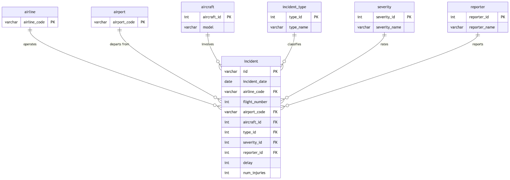

# Flight Incident Database & Analytics Dashboard

An end-to-end relational database project in R and SQLite. It normalizes
18,042 flight incident records into a 3NF schema, loads them into a
database, validates the load against the source data, and serves the
results through an interactive Shiny dashboard.

## Tech stack
- **Languages:** R, SQL
- **Database:** SQLite
- **R packages:** DBI, RSQLite, Shiny, ggplot2, DT

## How it works

### 1. Design
I identified the functional dependencies in the raw incident data and
decomposed it into seven relations in 3NF (and BCNF): six lookup tables
for airlines, airports, aircraft, incident types, severity ratings, and
reporters, plus a central `incident` fact table.

### 2. Load
`load_DB.R` reads the source CSV, builds each lookup table from the
unique values, maps surrogate keys back to every incident, and inserts
the fact table in batches of 500 rows inside a single transaction, so a
failed load leaves the database unchanged.

### 3. Validate
`test_DB_Loading.R` compares the database against the original CSV
across eight checks, including row counts, distinct airlines and
flights, date ranges, and aggregate totals for delays and injuries.

### 4. Visualize
`app.R` launches a single-screen Shiny dashboard with summary statistics
and charts of incidents by year, month, type, severity, and airline. An
**Add Incident** tab inserts new records through a parameterized query
and refreshes every view automatically.

## Project structure
    ├── db_connect.R              # Connection and insert helpers
    ├── create_DB.R               # Creates the normalized schema
    ├── load_DB.R                 # Loads and transforms the CSV data
    ├── config_Business_Logic.R   # Demonstrates inserting a new incident
    ├── test_DB_Loading.R         # Validates the load against the CSV
    ├── delete_DB.R               # Drops all tables for a clean reset
    ├── app.R                     # Shiny analytics dashboard
    └── docs/                     # ERD and dashboard screenshot

## Running it yourself
1. Clone this repository and open the folder in RStudio.
2. Run these scripts in order:
   `create_DB.R` → `load_DB.R` → `config_Business_Logic.R` →
   `test_DB_Loading.R`
3. Launch the dashboard with `shiny::runApp("app.R")`.

Required packages install automatically on first run.

## Data
Incident data comes from
[incidents-v2.csv](https://s3.us-east-2.amazonaws.com/artificium.us/datasets/incidents-v2.csv),
provided for CS 3200 (Database Design) at Northeastern University.

## Author
**Violet Fiorella** · [LinkedIn](https://linkedin.com/in/violetfiorella)
